# Project Documentation: Cloud Automation Tool - React Frontend

## Project Overview

This project is a web application built with React.js that serves as an internal automation tool that simplifies the creation of Azure CAF configuration files (tfvars). Users can fill out a form, providing the necessary inputs. The form data is then converted to JSON and sent to a backend API server. The backend processes the JSON input, generates tfvars files using Jinja2 templates, and returns the tfvars data. The tfvars data is displayed in a text area on the page, allowing users to review and make any necessary changes. Additionally, the interface provides convenient features to save the tfvars data as a file or copy it to the clipboard, enabling users to quickly download or share the generated tfvars files.

## Installation and Setup

### Prerequisite

- Node.js (v18.16.0 or higher)
- npm (v9.7.2 or higher)

### Quickstart

1. Clone the repository to your local machine.
2. Navigate to the project directory: `cd ti-automation-ui`
3. Install dependencies: `npm install`
4. Set up environment variables:
   - Ensure there is a `.env` file in the root directory.
   - Modify the `REACT_APP_API_BASE_URL` environment variables if the backend API address has changed.
5. Start the development server: `npm start`
6. Access the application at [http://localhost:3000](http://localhost:3000)

## Architecture

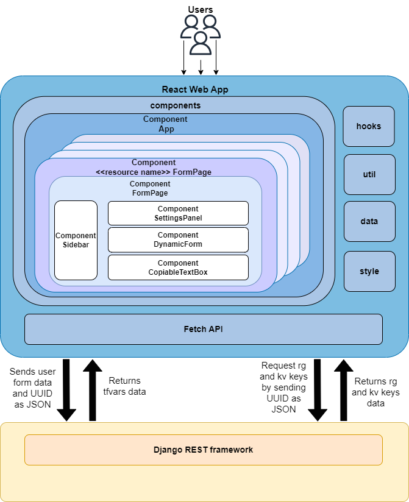  

*Architecture Diagram of the application*

The project follows a component-based architecture using React.js. It consists of the following key components:

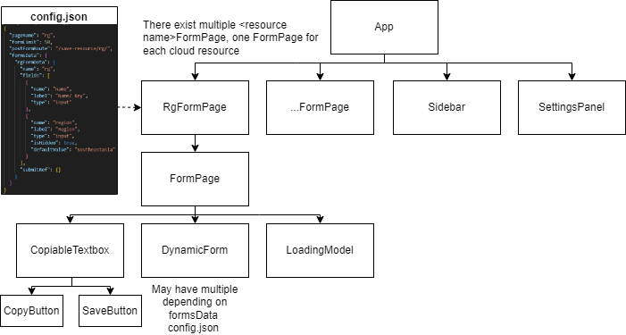  

*Component Diagram of the application*

- App: The root component that sets up the application and handles routing.
- FormPage: Component for creating form pages for cloud resource tfvars generation.

The project follows a directory structure as follows:

  ```bash
  project/
    ├── src/
    │   ├── components/
    │   │   ├── DynamicForm.js
    │   │   ├── FormPage.js
    │   │   └── ...
    │   ├── data/
    │   │   ├── pages.json
    │   │   └── ...
    │   ├── hooks/
    │   │   ├── use-clear-data-on-page-leave.js
    │   │   └── ...
    │   ├── pages/
    │   │   ├── KvFormPage
    │   │   │   ├── config.json
    │   │   │   └── KvFormPage.js
    │   │   ├── RgFormPage
    │   │   │   ├── config.json
    │   │   │   └── RgFormPage.js
    │   │   └── ...
    │   │       └── ...
    │   ├── styles/
    │   │   ├── index.css
    │   │   └── ...
    │   ├── utils/
    │   │   ├── fetchWithTimeout.js
    │   │   └── ...
    │   ├── App.js
    │   ├── index.js
    │   └── ...
    ├── public/
    │   ├── index.html
    │   └── ...
    ├── .env
    ├── package.json
    ├── README.md
    ├── Dockerfile
    └── ...
  ```

## Technologies and Libraries

The project utilizes the following key technologies and libraries:

- React (v18.2.0)
- React Hook Form (v7.43.9)
- React Icons (v4.9.0)
- React Widgets (v5.8.4)
- UUID (v9.0.0)
- Body Scroll Lock (v4.0.0-beta.0)

## User Guide

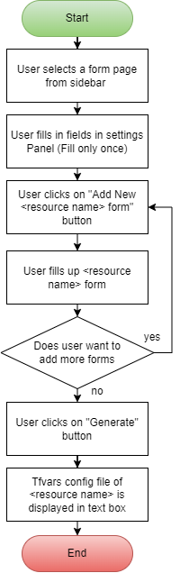  

*Flow Diagram of users using the form pages to generate cloud resources tfvars*  

### Generating of cloud resources tfvars

The generating of cloud resource tfvarst feature allows users to fill up a simple GUI form and generate cloud resources tfvars:

1. Navigate to the cloud resource form of choice form pages via the sidebar
2. Fill up the fields in the settings panel at the top of the form (only once per session).
3. Fill up the form fields, there are currently three types of form fields, input, select and combobox.
4. You may click on the `Add New <Cloud resource name> Form` if you wish to generate tfvars for multiple cloud resources.
5. Click on `Generate` button and after a few seconds the generated tfvars will appear in the text box below.  

    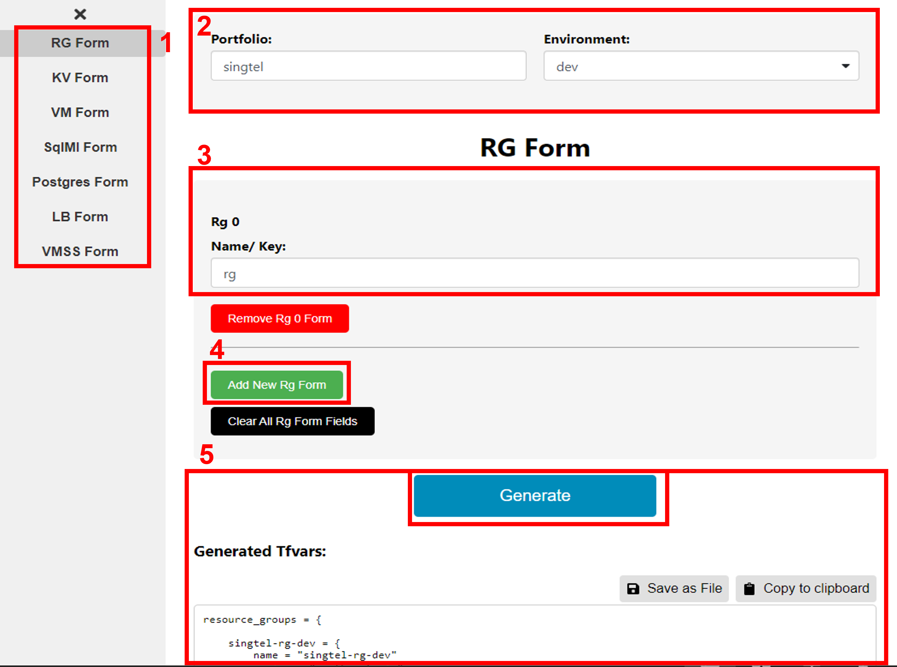

### Saving of data from text box as file

The saving of data from text box as file feature allows users to save generated tfvars data as a file with a user given file name and extension.

1. First ensure there is tfvars data displayed in the textbox once `Generate` button is clicked.
2. Click on the `Save as File` button with the diskette icon.
3. A tfvars file of the cloud resource will be downloaded.  

    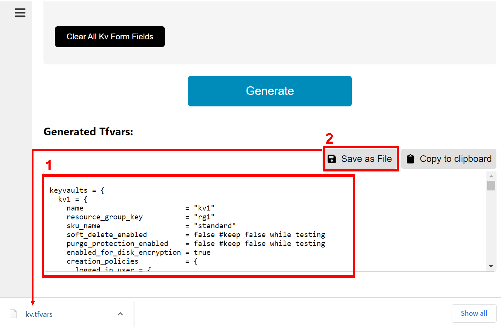

### Copying of data from text box to clipboard

the copying of data from text box to clipbox feature allows users to copy generated tfvars data to clipboard and then can be pasted to any code editor of choice.

1. First ensure there is tfvars data displayed in the textbox once `Generate` button is clicked.
2. Click on the `Copy to clipboard` button with the clipboard icon and the button text should changed to `Copied!`.
3. Paste the data copied to any code editor of your choice.  

    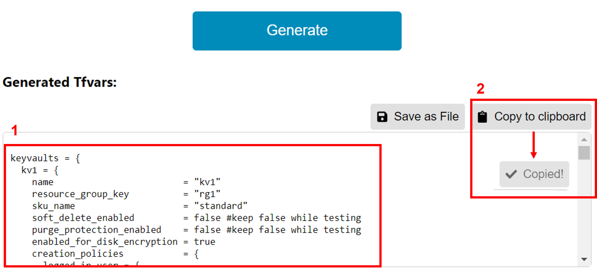

## Configuration

The project uses environment variables to handle configuration. The following variables can be set in the `.env` file:

- `REACT_APP_API_BASE_URL`: The base URL for the API endpoints.

## Development Guidelines

- Follow the Airbnb JavaScript Style Guide for code formatting and style.
- Use meaningful variable and function names to enhance code readability.
- Write clear and concise comments in JSDoc style to explain components and functions.
- Utilize Git branching and pull requests for collaborative development.

### Adding new form pages

1. Modify the file `./src/data/pages.json` and add the id, page name and component name of the new cloud resource.  

    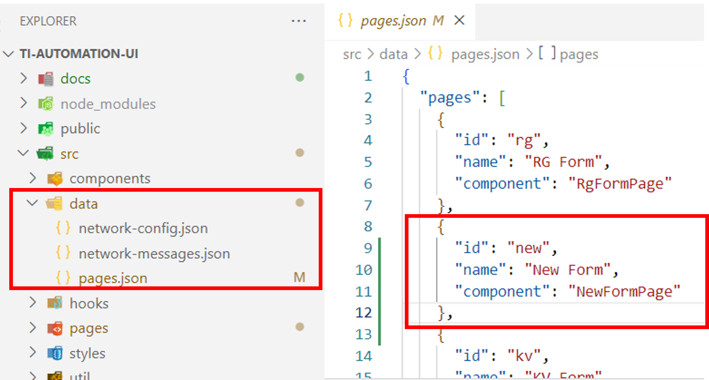  

2. Navigate to `./src/pages/` and create a new folder, the name of the new folder should be the same one as the component name you filled in the previous step.  

    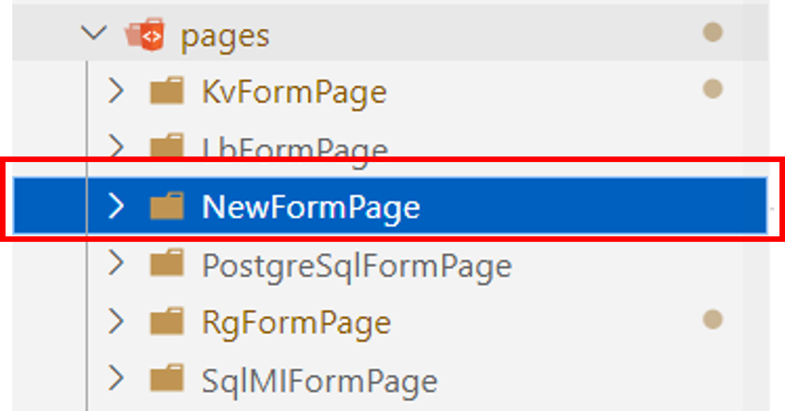  

3. Create two files `<component name>.js` and `config.json`.  

    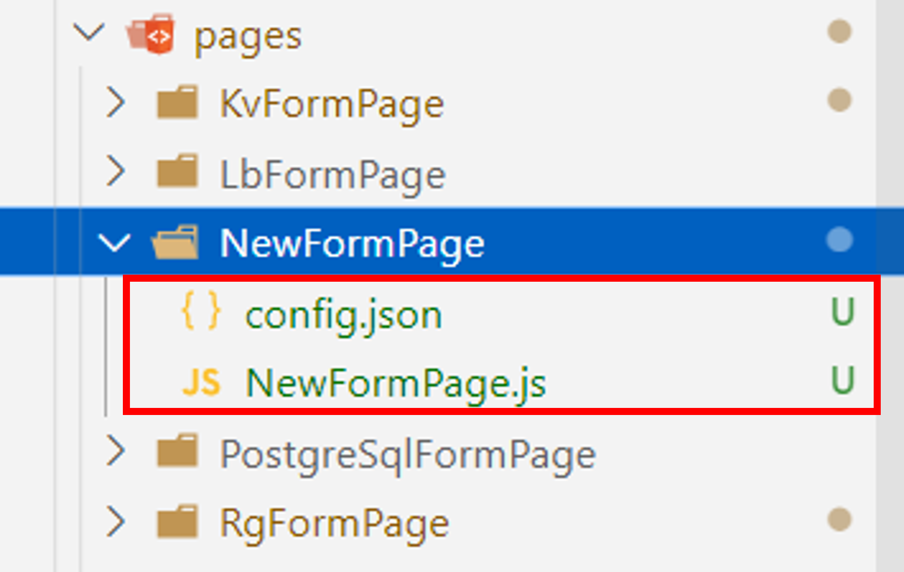  

4. Navigate to an existing form page folder for example `./src/pages/KvFormPage/`, copy the contents of the javascript file and paste it into our newly create `<component name>.js`.  

    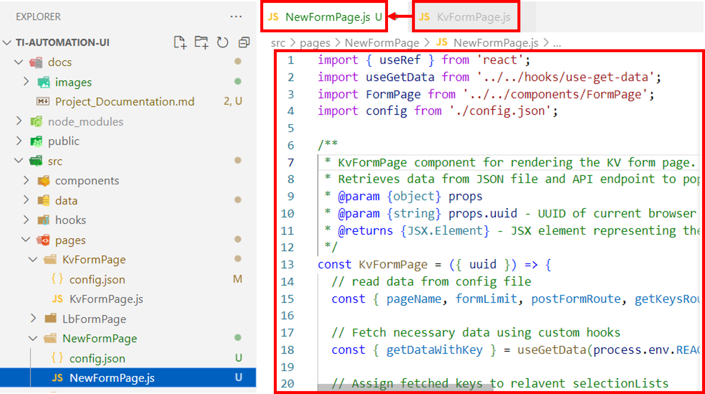  

5. Modify the contents `<component name>.js` for the new cloud resource, for example in this case find and replace all instance of `kv` with the new cloud resource `id`.  

    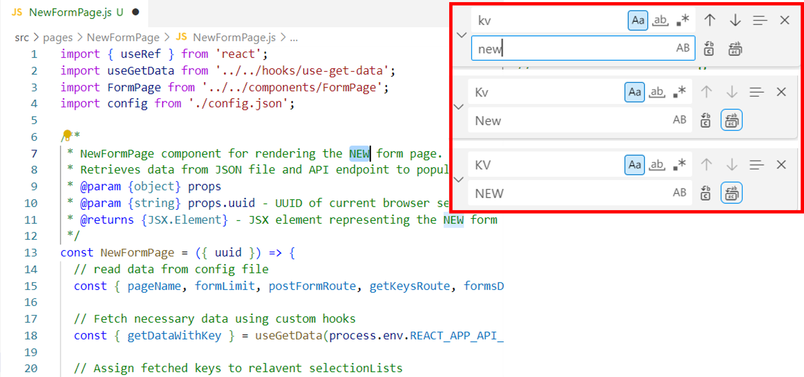  

6. Navigate to an existing form page folder for example `./src/pages/KvFormPage/`, copy the content of the json file and paste it into our newly created `config.json`.  

    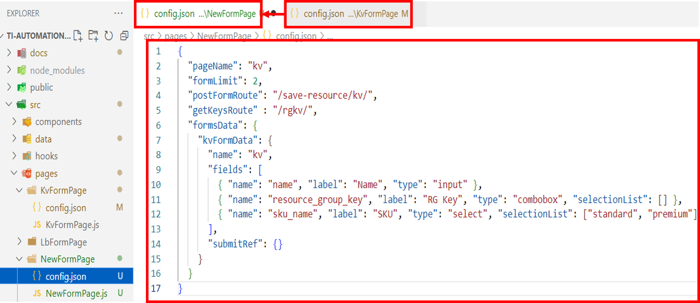  

7. Modify the contents `config.json` for the new cloud resource, for example in this case find and replace all instance of `kv` with the new cloud resource `id`. Additionally, we add, modify or remove form fields as required for the new cloud resource.  

    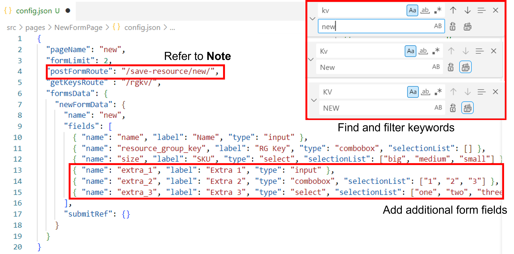  

    **Note** Refer to backend API documentation or contact application owner of backend API for the postFormRoute field of the new cloud resource.  

8. Finally open `./src/App.js` and import our new created `<component name>.js` and add the imported component to the `PageComponents` object.  

    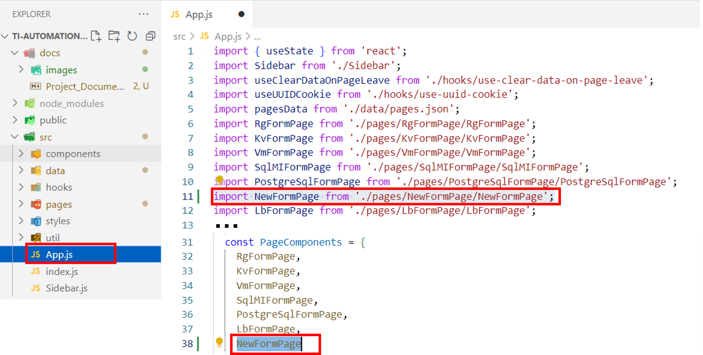  

    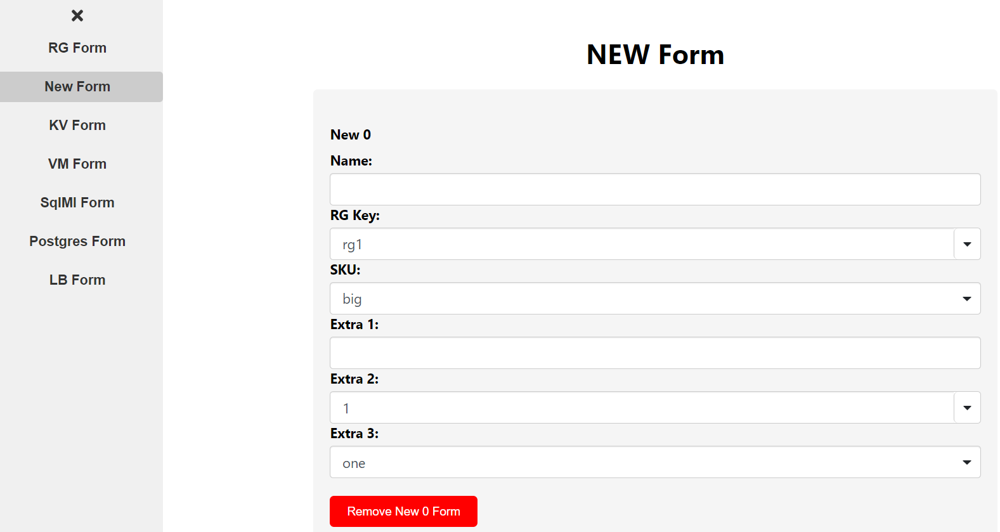  

### Code Comments

All components, hooks, util and functions in this project are commented. The comments are written in JSDoc style.

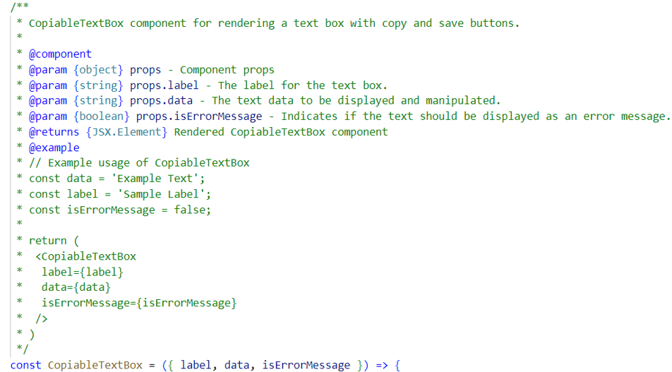  

*Example of a component commented with JSDoc style comment*  

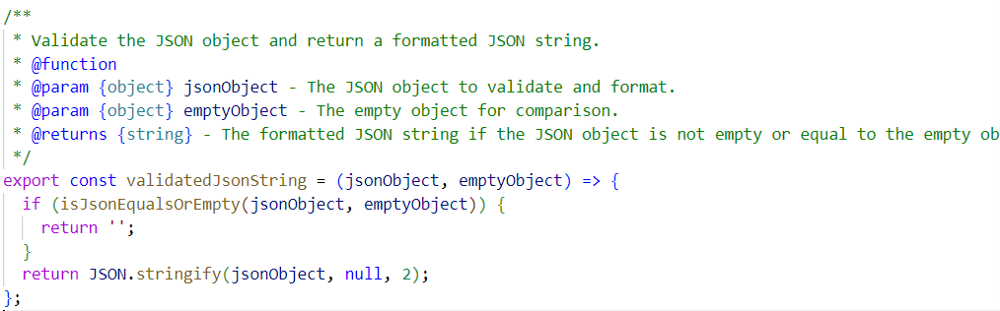  

*Example of a function commented with JSDoc style comment*  

When developing in IDEs that support JSDoc you can hover over the Component or function to preview the details written in JSDoc..  

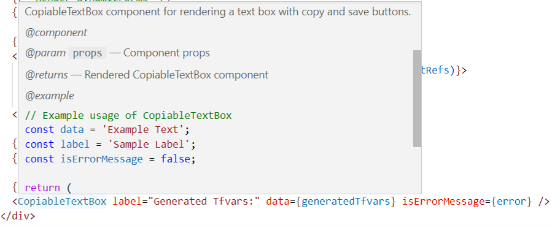  

*VSCode IDE rendering JSdoc comment preview*  

## Deployment

To deploy the Cloud Automation Tool UI as a Docker image on OpenShift, follow these steps:

1. Build the Docker image: Run the following command in the project directory from a machine that has Docker installed:

   ```bash
   docker build -t ti-automation-ui .
   ```

2. Login to Azure container registry (ACR): Run the following command to login to ACR:

   ```bash
   docker login -u <azure-container-username> -p  "<azure-container-password>" <azure-container-registry>
   ```

   Replace `<azure-container-username>` with the username, `<azure-container-password>` with the password and `<azure-container-registry>` with the URL of your ACR.

3. Tag the Docker image: Run the following command to tag the image for ACR:

   ```bash
   docker tag ti-automation-ui:latest <azure-container-registry>/tiauto/ui:<version-number>
   ```

   Replace `<version-number>` with the version number, usually version number is +1 of the previous version number in ACR.

4. Push the Docker image to the ACR: Run the following command to push the image to the registry:

   ```bash
   docker push <azure-container-registry>/tiauto/ui:<version-number>
   ```

5. Login to the Openshift web console  

    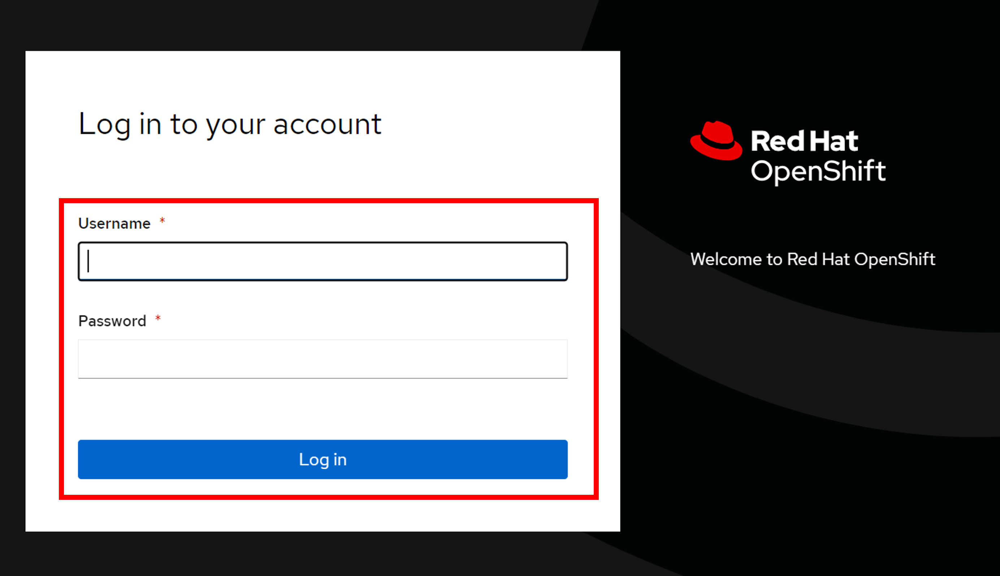
  
6. On the navigation side bar find and select Projects, filter the project with name "ti-automation" and select the project this will ensure the deployments in the future steps will use the correct project.  

    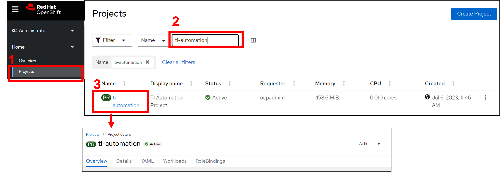

7. On the navigation side bar find and select Deployments, click on "Create Deployment" button and fill up the details 3 to 6 highlighted in the screenshot.  

    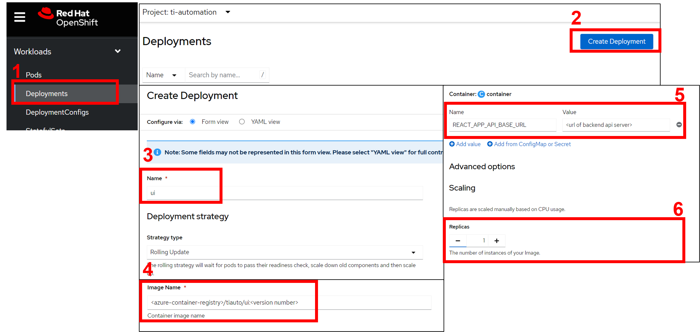

8. On the navigation side bar find and select Services, click on "Create Service" button and fill up the details 3 to 5 highlighted in the screenshot.  

    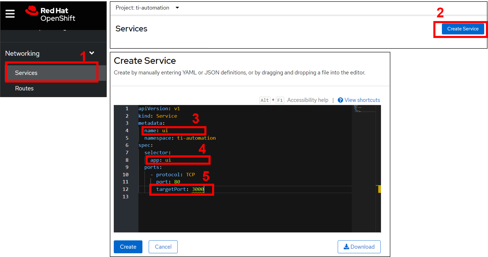

9. Finally, on the navigation side bar find and select Routes, click on "Create Routes" button and fill up the details 3 to 8 highlighted in the screenshot.

    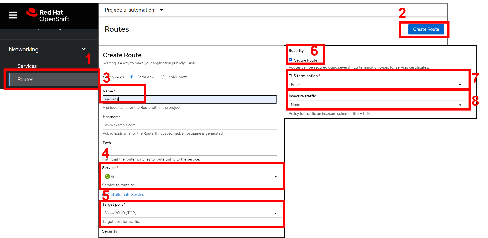

10. Access the React app using the corresponding url in the Routes page.

    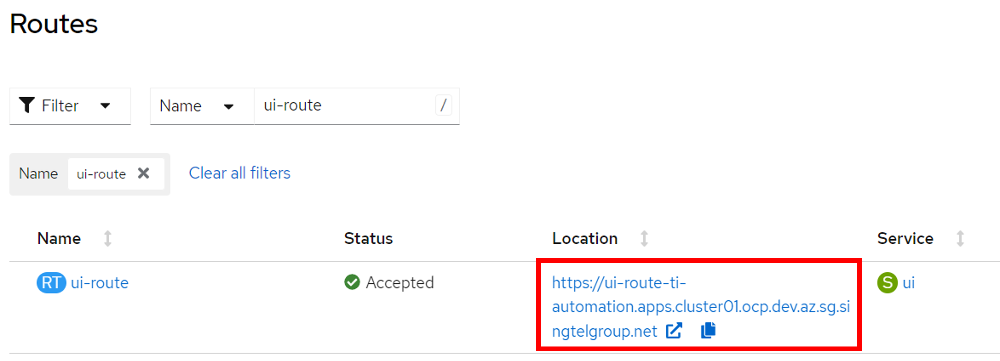

## Troubleshooting and FAQ

### Common Issues

Issue: Error message "Could not establish connection to backend or it is unresponsive. Please try again later."

Solution: Ensure that the backend server is running and the `REACT_APP_API_BASE_URL` environment variable is correctly set.

Issue: Error message "ERROR: HTTP status 500 Internal Server Error"

Solution: Ensure that the routes in config.json for the form page that is showing this error message is correct. If it is confirmed to be correct, contact the developer in charge of the backend API.

### FAQ

Q: I dont know anything about React, what should I do?

A: Watch this comprehensive Udemy course on React, <https://www.udemy.com/course/react-redux/>, this is everything you need to get started.

## Contributing Guidelines

To contribute to the project, follow these guidelines:

1. Fork the repository and create a new branch for your feature or bug fix.
2. Make your changes.
3. Commit your changes with descriptive commit messages.
4. Open a pull request, providing a detailed description of the changes and their purpose.
5. Participate in the code review process and address any feedback.

## API Documentation

This project interacts with the following APIs:

### save-resource

Endpoint: `/save-resource/<resource>`

Methods:

- POST `/save-resource/rg`: Sends **resource group** form data in a JSON format to the backend server, backend reponse with Tfvars data generated from JSON data. The server also saves the keys of the **resource group** resource.
- POST `/save-resource/kv`: Sends **key vault** form data in a JSON format to the backend server, backend reponse with Tfvars data generated from JSON data. The server also saves the keys of the **key vault** resource.

Requires:

- JSON request body in the following format:

  ``` JSON
    {
      "uuid": "<<uuid string>>",
      "data": [
        {
          "obj1_key1": "obj1_value1",
          "obj1_key2": "obj1_value2",
          ...
        },
        {
          "obj2_key1": "obj2_value1",
          "obj2_key2": "obj2_value2",
          ...
        },
        ...
      ]
    }
  ```

### make-resource

Endpoint: `/make-resource/<resource>`

Methods:

- POST `/make-resource/vm`: Sends **virtual machine** form data in a JSON format to the backend server, backend reponse with Tfvars data generated from JSON data resource.
- POST `/make-resource/pgdb`: Sends **Postgres** form data in a JSON format to the backend server, backend reponse with Tfvars data generated from JSON data.
- POST `/make-resource/sqlmi`: Sends **SQL MI** form data in a JSON format to the backend server, backend reponse with Tfvars data generated from JSON data.

Requires:

- JSON request body in the following format:

  ``` JSON
    {
      "uuid": "<<uuid string>>",
      "data": [
        {
          "obj1_key1": "obj1_value1",
          "obj1_key2": "obj1_value2",
          ...
        },
        {
          "obj2_key1": "obj2_value1",
          "obj2_key2": "obj2_value2",
          ...
        },
        ...
      ]
    }
  ```

### rg-kv

Endpoint: `/rgkv/`

Methods:

- POST `/rgkv/`: Returns all **resource group** and **key vault** keys associated with the UUID stored in the backend API server.

Requires:

- JSON request body in the following format:

  ``` JSON
    {
      "uuid": "<<uuid string>>",
    }
  ```

### end-session

Endpoint: `/end-session/`

Methods:

- POST `/rgkv/`: Clears all **resource group** and **key vault** keys associated with the UUID stored in the backend API server.

Requires:

- JSON request body in the following format:

  ``` JSON
    {
      "uuid": "<<uuid string>>",
    }
  ```

### Dependencies

- Body Scroll Lock: v4.0.0-beta.0
- React: v18.2.0
- ReactDOM: v18.2.0
- React Hook Form: v7.43.9
- React Icons: v4.9.0
- React Widgets: v5.8.4
- UUID: v9.0.0

---

This documentation provides an overview of the example project, including installation instructions, architecture details, features, configuration, development guidelines, deployment, troubleshooting, and more. It aims to ensure that the project is well-documented and accessible to anyone who takes over the project in the future.
